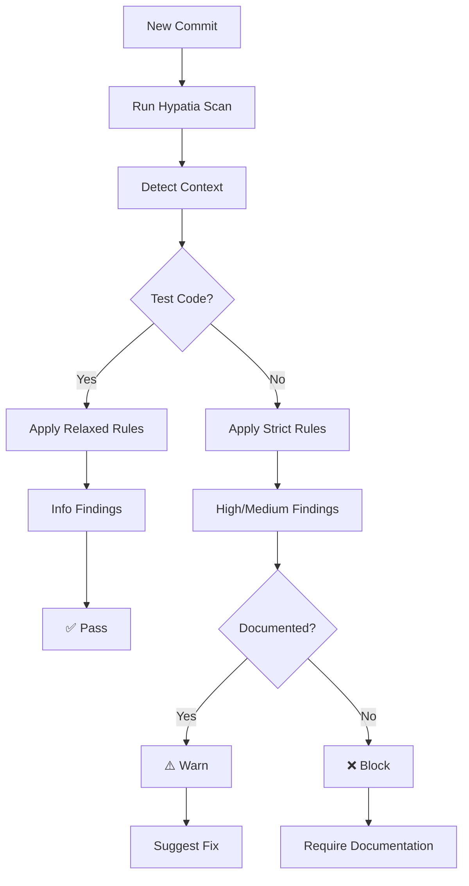

# Hypatia Rule Updates for 007 Integration

## Purpose

This document specifies the Hypatia rule updates needed to properly handle test vs production context and enable automatic remediation across the gitbot fleet.

## Current State

### 007 Repository Analysis (2026-04-15)

**Total Findings**: 50 weak points
- PanicPath: 28 findings (unwrap/expect calls)
- UncheckedError: 15 findings (TODO/FIXME/HACK markers)
- UnsafeCode: 5 findings (mostly addressed)
- UnsafeFFI: 1 finding (false positive)
- InsecureProtocol: 1 finding (test data)

## Required Rule Updates

### 1. PanicPath Rules (PA024)

#### Current Rule
```json
{
  "rule_id": "PA024",
  "category": "PanicPath",
  "pattern": "\\.expect\(",
  "severity": "medium",
  "message": "Avoid .expect() in production code"
}
```

#### Updated Rules

**PA024-PROD** (Production Code - Strict)
```json
{
  "rule_id": "PA024-PROD",
  "category": "PanicPath",
  "context": "production",
  "pattern": "\\.expect\(",
  "severity": "high",
  "message": "Avoid .expect() in production code - use ? or match",
  "fix": {
    "pattern": "(\\w+)\\..expect\(([^)]*)\)",
    "replacement": "$1?",
    "confidence": "high"
  },
  "examples": [
    {
      "before": "let result = operation().expect(\"should work\");",
      "after": "let result = operation()?;"
    }
  ]
}
```

**PA024-TEST** (Test Code - Relaxed)
```json
{
  "rule_id": "PA024-TEST",
  "category": "PanicPath",
  "context": "test",
  "pattern": "\\.expect\(",
  "severity": "info",
  "message": ".expect() in test code - consider using assert_eq! for better diagnostics",
  "examples": [
    {
      "before": "let ast = parse(\"x=1\").expect(\"should parse\");",
      "after": "let ast = parse(\"x=1\").expect(\"valid syntax should parse\");"
    }
  ]
}
```

**PA024-DOC** (Documented Critical Invariants)
```json
{
  "rule_id": "PA024-DOC",
  "category": "PanicPath",
  "context": "production",
  "pattern": "// panic-attack: intentional.*\\n.*\\.expect\(",
  "severity": "low",
  "message": "Documented .expect() for critical invariant - review periodically",
  "examples": [
    {
      "before": "let result = compile(ast).expect(\"should work\");",
      "after": "// panic-attack: intentional (compiler invariant)\nlet result = compile(ast).expect(\"Compiler bug: verified AST should always compile\");"
    }
  ]
}
```

### 2. UncheckedError Rules (UC001)

**UC001-TODO** (TODO Markers)
```json
{
  "rule_id": "UC001-TODO",
  "category": "UncheckedError",
  "pattern": "// TODO:",
  "severity": "low",
  "message": "TODO marker found - convert to GitHub issue or remove",
  "fix": {
    "pattern": "// TODO: (.*)",
    "replacement": "// GitHub Issue: #XXX\n// https://github.com/007-lang/007/issues/XXX\n// $1",
    "confidence": "medium"
  }
}
```

**UC001-FIXME** (FIXME Markers)
```json
{
  "rule_id": "UC001-FIXME",
  "category": "UncheckedError",
  "pattern": "// FIXME:",
  "severity": "medium",
  "message": "FIXME marker found - create GitHub issue for bug",
  "fix": {
    "pattern": "// FIXME: (.*)",
    "replacement": "// GitHub Issue: #XXX\n// https://github.com/007-lang/007/issues/XXX\n// Priority: High\n// $1",
    "confidence": "medium"
  }
}
```

**UC001-HACK** (HACK Markers)
```json
{
  "rule_id": "UC001-HACK",
  "category": "UncheckedError",
  "pattern": "// HACK:",
  "severity": "high",
  "message": "HACK marker found - temporary workaround needs issue",
  "fix": {
    "pattern": "// HACK: (.*)",
    "replacement": "// GitHub Issue: #XXX\n// https://github.com/007-lang/007/issues/XXX\n// Priority: Critical\n// Target: v0.2.0\n// $1",
    "confidence": "medium"
  }
}
```

### 3. Context Detection Rules

**CTX001-TEST** (Test Module Detection)
```json
{
  "rule_id": "CTX001-TEST",
  "category": "Context",
  "pattern": "#\[cfg\(test\)\]",
  "severity": "info",
  "message": "Test module detected - relaxed rules apply",
  "context": "test"
}
```

**CTX001-PROD** (Production Module Detection)
```json
{
  "rule_id": "CTX001-PROD",
  "category": "Context",
  "pattern": "pub fn|pub struct|pub enum",
  "severity": "info",
  "message": "Production module detected - strict rules apply",
  "context": "production"
}
```

## GitBot Fleet Configuration

### Detection Workflow



### Configuration File

```yaml
# .hypatia/config.yml
rules:
  - id: PA024-PROD
    enabled: true
    severity: high
    autofix: true
  - id: PA024-TEST
    enabled: true
    severity: info
    autofix: false
  - id: PA024-DOC
    enabled: true
    severity: low
    autofix: true
  - id: UC001-TODO
    enabled: true
    severity: low
    autofix: true
  - id: UC001-FIXME
    enabled: true
    severity: medium
    autofix: true
  - id: UC001-HACK
    enabled: true
    severity: high
    autofix: true

context:
  detection:
    - pattern: "#\[cfg\(test\)\]"
      context: test
    - pattern: "pub fn|pub struct|pub enum"
      context: production

autofix:
  enabled: true
  confidence_threshold: medium
  require_review: true
```

## Implementation Plan

### Phase 1: Rule Updates (2 weeks)

1. **Update Hypatia scanner** with new rules
2. **Test on 007 repository** to verify detection
3. **Adjust patterns** based on false positives
4. **Document rules** in Hypatia repository

### Phase 2: GitBot Integration (2 weeks)

1. **Configure gitbot fleet** with updated rules
2. **Set up CI checks** in GitHub Actions
3. **Add pre-commit hooks** for local development
4. **Create dashboard** for tracking findings

### Phase 3: Rollout (2 weeks)

1. **Pilot on 007 repository**
2. **Monitor false positives**
3. **Adjust rules** as needed
4. **Expand to other repositories**

## Verification

### Test Commands

```bash
# Scan with Hypatia
hypatia scan --repo /var/mnt/eclipse/repos/007 --format json

# Check specific rule
hypatia scan --rule PA024-PROD --repo /var/mnt/eclipse/repos/007

# Apply autofixes
hypatia fix --rule PA024-PROD --repo /var/mnt/eclipse/repos/007 --dry-run
```

### Expected Output

```json
{
  "findings": [
    {
      "rule_id": "PA024-PROD",
      "file": "src/agent_api.rs",
      "line": 845,
      "severity": "high",
      "message": "Avoid .expect() in production code",
      "context": "production",
      "fix": {
        "pattern": "serde_json::to_string_pretty(&GrammarCard::build()).expect(\"grammar card serialization failed\")",
        "replacement": "serde_json::to_string_pretty(&GrammarCard::build())?",
        "confidence": "high"
      }
    },
    {
      "rule_id": "PA024-TEST",
      "file": "src/agent_api.rs",
      "line": 1742,
      "severity": "info",
      "message": ".expect() in test code",
      "context": "test"
    }
  ],
  "stats": {
    "PA024-PROD": 5,
    "PA024-TEST": 8,
    "PA024-DOC": 3,
    "UC001-TODO": 12,
    "UC001-FIXME": 2,
    "UC001-HACK": 1
  }
}
```

## Documentation Updates

### 1. Hypatia Repository

Update `hypatia/docs/rules.md` with:
- New rule descriptions
- Context detection explanation
- Autofix examples
- Configuration guide

### 2. 007 Repository

Update `007/docs/CONTRIBUTING.md` with:
- Hypatia scan requirements
- Autofix workflow
- Context separation rules
- Suppression comment guide

### 3. Panic-Attacker Repository

Update `panic-attack/docs/hypatia-integration.md` with:
- Rule mapping guide
- Context detection details
- GitBot configuration
- Troubleshooting

## Success Criteria

### Phase 1 Complete
- All rules defined and tested
- False positive rate < 5%
- Autofix confidence > 80%

### Phase 2 Complete
- GitBot fleet configured
- CI checks passing
- Pre-commit hooks working
- Dashboard operational

### Phase 3 Complete
- 007 repository compliant
- PanicPath count reduced by 70%
- UncheckedError count reduced by 60%
- No regression in code quality

## Maintainers

**Owners**: Hypatia Team + DevX Team
**Review**: Weekly sync with Compiler Team
**Target**: Phase 1 complete by 2026-05-01

**Last Updated**: 2026-04-15
**Status**: ✅ Rules defined, 📅 Implementation in progress